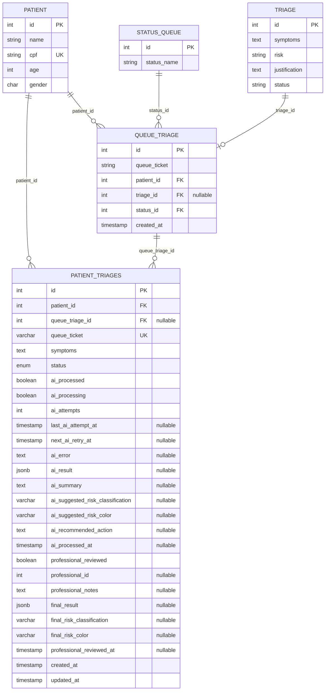

# Diagrama do Banco de Dados

Baseado nas entidades TypeORM em `src/shared/entities` e no script `sql/patient-triages.sql`.

## Observações

- `patient.cpf` é único pela entidade TypeORM.
- `patient_triages.queue_ticket` é único pelo script SQL.
- `patient_triages.status` usa o enum `falaidoutor.patient_triage_status` com os valores `PENDING`, `AI_PROCESSING`, `WAITING_PROFESSIONAL_REVIEW` e `COMPLETED`.
- `patient_triages.updated_at` é atualizado por trigger no script `sql/patient-triages.sql`.
- A configuração TypeORM esta com `synchronize: false`, então a estrutura real depende das migrations/scripts aplicados no banco.
